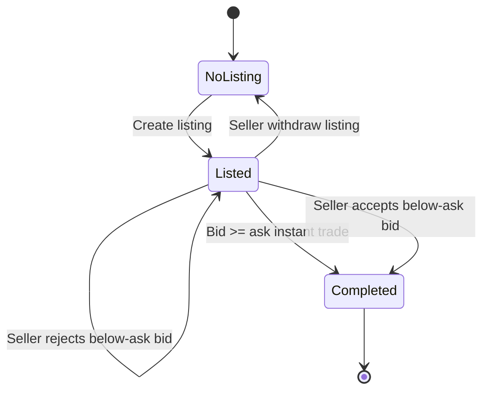

# Data Model: Trading Pets (004)

## Overview

Logical entities for the Trading Pets platform. Physical mapping: EF Core tables in market-service SQL database unless noted.

---

## Entity: Trader

| Field | Type | Notes |
|-------|------|--------|
| Id | GUID | PK |
| DisplayName | string | Shown in notifications and leaderboard |
| ExternalUserId | string (nullable) | Auth0 `sub` when 1:1 mapping |
| AvailableCash | decimal | ≥ 0 |
| LockedCash | decimal | ≥ 0; sum of active bid locks |
| CreatedAt | datetimeoffset | |

**Relationships**: One-to-many **Pet** (ownership), **Notification**, **Bid** (as buyer), **Listing** (as seller).

**Validation / invariants**

- `AvailableCash + LockedCash` components match ledger rules: lock increases only on active bid; unlock on outbid, withdraw, reject, accept settlement, listing withdraw.
- Portfolio total (computed): `AvailableCash + LockedCash + Σ intrinsic value of owned pets` (A-001).

**State transitions**: Created at seed/bootstrap; cash fields mutate via commands (purchase, bid, trade settlement).

---

## Entity: Breed

| Field | Type | Notes |
|-------|------|--------|
| Id | GUID or int | PK |
| Name | string | |
| Category | enum | Dog, Cat, Bird, Fish — exactly **5 each** (FR-004) |
| LifespanYears | decimal | > 0 |
| BaselineDesirability | int | 1–10 |
| MaintenanceCost | decimal | informational for analysis |
| RetailPrice | decimal | base price for formula and primary market |

**Relationships**: One-to-many **Pet**; one **Supply** row per breed.

**Validation**: Exactly **20** breeds enforced by seed/migration. **Read-only** at runtime via product UI (FR-004).

---

## Entity: Supply (per breed)

| Field | Type | Notes |
|-------|------|--------|
| BreedId | FK | |
| RemainingCount | int | ≥ 0; decremented on primary purchase (FR-006) |

---

## Entity: Pet

| Field | Type | Notes |
|-------|------|--------|
| Id | GUID | PK |
| BreedId | FK | |
| OwnerTraderId | FK | |
| AgeYears | decimal | Starts 0 at mint (FR-005) |
| Health | decimal | 0–100 after clamp |
| CurrentDesirability | int | 1–10 after clamp; drifts from baseline (research R-4) |
| IsExpired | bool | `AgeYears >= LifespanYears` (align tick granularity in impl) |
| CreatedAt | datetimeoffset | |

**Intrinsic value (computed, persisted or on read)**

`RetailPrice(Breed) × (Health/100) × (CurrentDesirability/10) × max(0, 1 − AgeYears/LifespanYears)`  
(Research R-3, R-4.)

**Validation / invariants**

- Owner must exist; pet in **inventory** when not in completed secondary transfer mid-flight (see Listing/Bid).
- At most **one active Listing** per pet (FR-011).

---

## Entity: Listing (secondary)

| Field | Type | Notes |
|-------|------|--------|
| Id | GUID | PK |
| PetId | FK | Unique filter for **active** |
| SellerTraderId | FK | Must equal pet owner at creation |
| AskingPrice | decimal | > 0 (FR-010) |
| CreatedAt | datetimeoffset | For default sort **newest first** (FR-018) |
| WithdrawnAt | datetimeoffset? | null = active |

**State transitions**

- **Create**: pet owned, no other active listing for pet.
- **Withdraw**: set `WithdrawnAt`; cancel active **below-ask Bid** if any (FR-017).
- **Filled (cross or accept)**: listing closed; pet transferred; record **Trade** (implementation may use `WithdrawnAt`, `SoldAt`, or status enum—document one).

---

## Entity: Bid

| Field | Type | Notes |
|-------|------|--------|
| Id | GUID | PK |
| ListingId | FK | |
| BuyerTraderId | FK | ≠ seller; cannot be pet owner (FR-013) |
| Amount | decimal | ≤ buyer’s available cash at submission; > 0 |
| Status | enum | Active, Withdrawn, Rejected, Superseded (outbid), Accepted |
| CreatedAt | datetimeoffset | |

**Invariants (FR-012–FR-015)**

- **Below-ask only**: at most **one Active pending** bid per listing; new **higher** below-ask bid **supersedes** prior (prior → Superseded, cash released).
- **Crossing bid (≥ ask)**: no long-lived Active bid—either validation failure or **immediate Trade**; any prior pending bid → Superseded, cash released.
- **Withdraw**: status Withdrawn, cash released.
- **Seller reject** (below-ask only): Active → Rejected, cash released.
- **Seller accept** (below-ask): trade executed at bid amount, pet transferred, cash settled.
- **Listing withdraw**: Active pending bid → Rejected (or voided), cash released.

**Buyer visibility (FR-016)**: API filters bid history so buyers only see **their** bids’ statuses on a listing.

---

## Entity: Trade (secondary, completed)

| Field | Type | Notes |
|-------|------|--------|
| Id | GUID | PK |
| PetId | FK | |
| ListingId | FK | |
| BuyerTraderId | FK | |
| SellerTraderId | FK | |
| Price | decimal | Executed at active bid amount |
| ExecutedAt | datetimeoffset | Drives “recent trade price by breed” (research R-2) |

---

## Entity: Notification

| Field | Type | Notes |
|-------|------|--------|
| Id | GUID | PK |
| TraderId | FK | Recipient |
| Type | enum | BidReceived, BidAccepted, BidRejected, BidWithdrawn, Outbid, ListingWithdrawn, … |
| PetId | GUID | |
| PetName | string | Denormalized for feed |
| Amount | decimal? | Price / bid amount |
| CounterpartyTraderId | GUID | |
| CounterpartyDisplayName | string | |
| CreatedAt | datetimeoffset | Chronological ordering (FR-021) |
| Correlation | string? | Optional: listing id / bid id for debugging |

---

## Configuration (non-EF or key-value)

| Key | Purpose |
|-----|---------|
| ValuationTickSeconds | Default 60 (FR-008) |
| InitialTraderCash | FR-002 |
| DefaultSupplyPerBreed | e.g. 3 per breed for **new-pet supply** (`system_reqs.md` §2.2)—**not** Trader count |
| Demo trader allowlist / mode | Research R-6 |

---

## ER sketch (text)

```text
Trader ──< Pet >── Breed
Breed ── Supply (1:1)
Pet ──< Listing (temporal: one active)
Listing ──< Bid
Listing ── Trade (0..1 completed)
Trader ──< Notification
```

---

## State diagram — Listing + Bid (simplified)



---

## Indexes (implementation hints)

- Listing: filter `(WithdrawnAt IS NULL)` + `CreatedAt DESC` for market feed.
- Trade: `(BreedId via Pet join)`, `ExecutedAt DESC` for last trade by breed.
- Notification: `(TraderId, CreatedAt DESC)`.
- Pet: `(OwnerTraderId)`.
